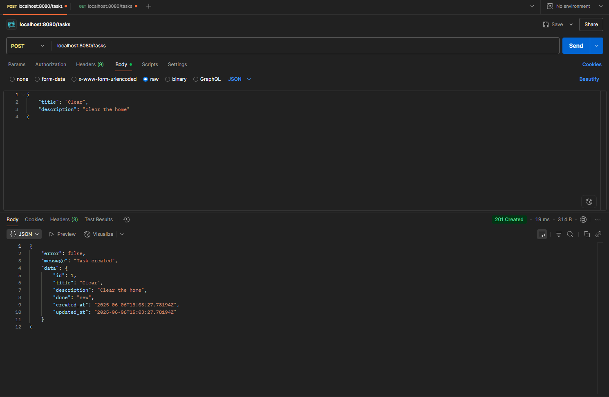
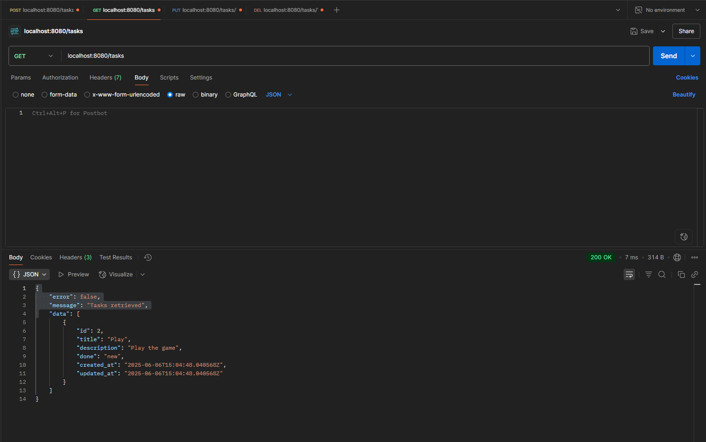
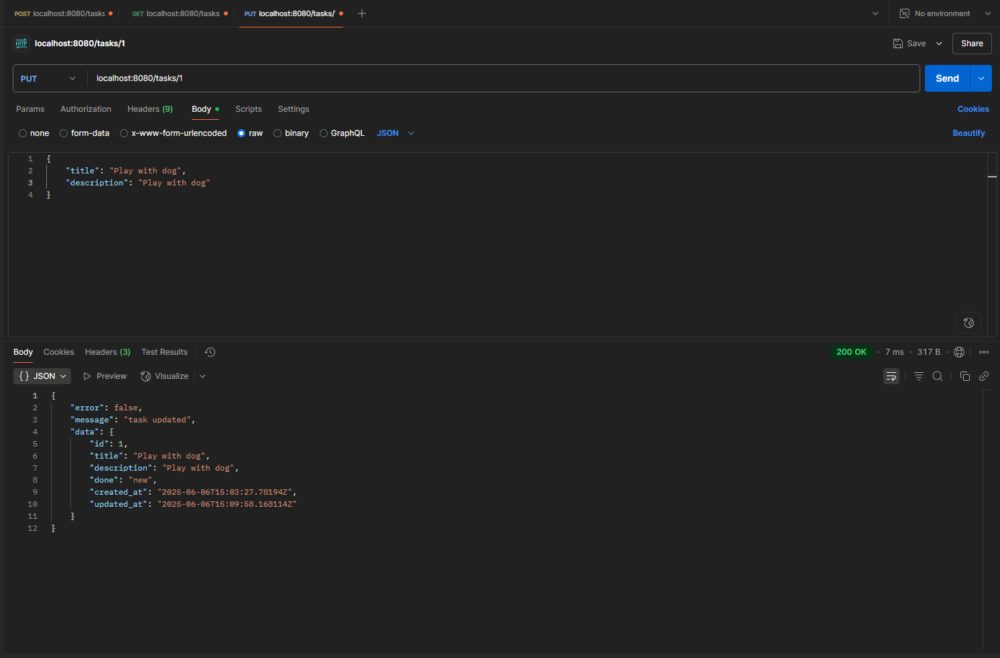
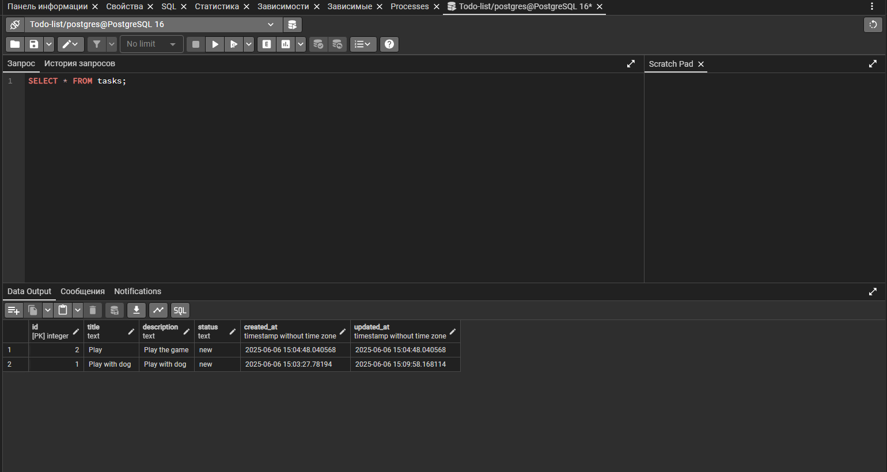
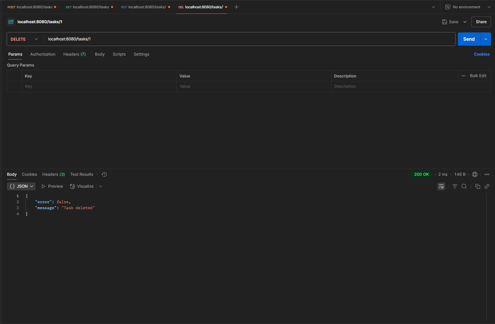

# TODO API на Go + Fiber + PostgreSQL

Простое REST API для управления задачами (TODO-лист) с использованием Go, Fiber и PostgreSQL. Поддерживает создание, просмотр, редактирование и удаление задач.

## 📦 Стек:
- Golang + Fiber
- PostgreSQL (`pgx`)
- REST API

## 🚀 Запуск

1. Создай файл `.env`:
```env
DB_HOST=localhost
DB_PORT=5432
DB_USER=postgres
DB_PASS=yourpassword
DB_NAME=yourdbname
```

2. Установите зависимости
```bash
go mod tidy
```

3. Запустите сервер
```bash
make run
```

## 📸 Скриншоты

### Успешный запрос (POST /tasks)


### Запись в базе данных


### Успешное получение всех задач (GET /tasks)


### Успешное изменение задачи (PUT /tasks/:id)


### Запись в базе данных


### Успешное удаление задачи (DELETE /tasks/:id)


### Запись в базе данных
